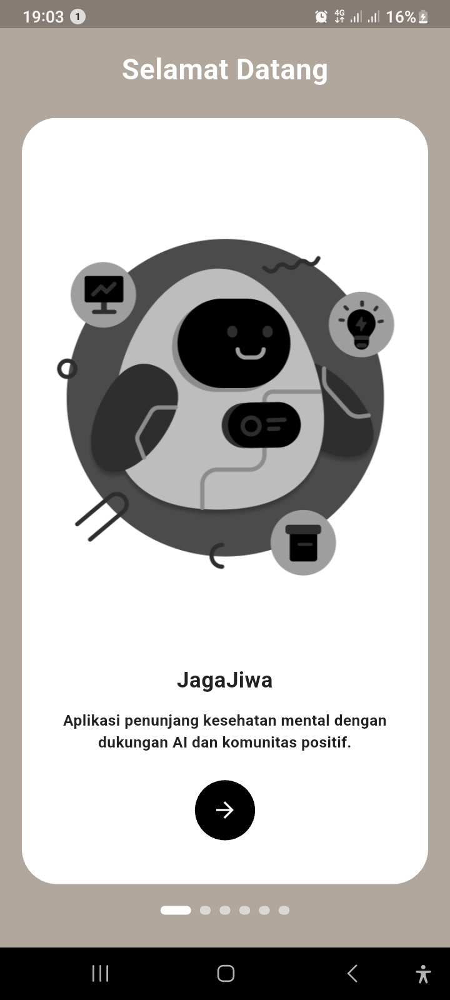
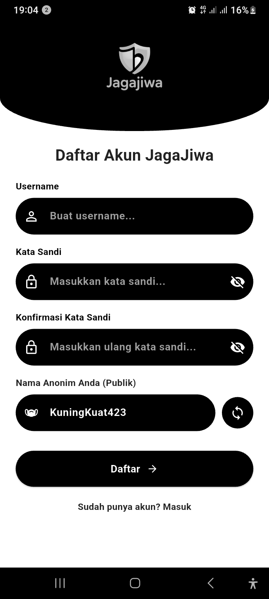
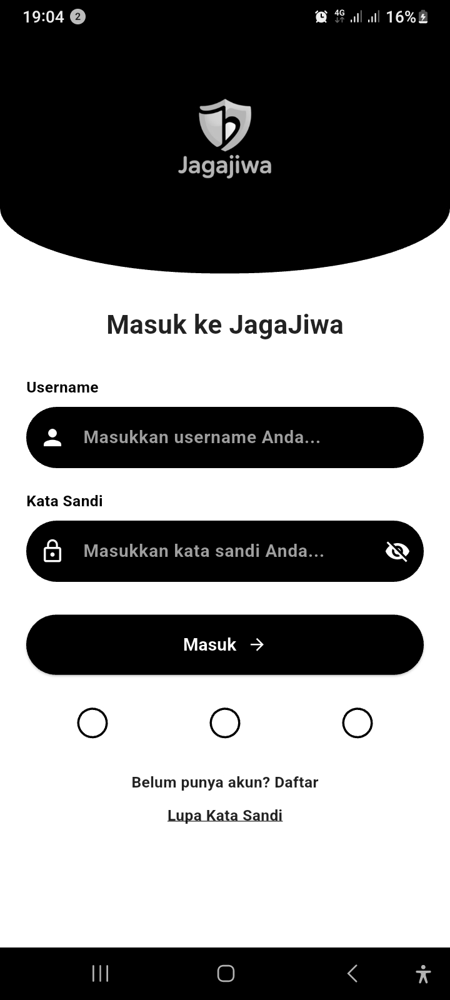
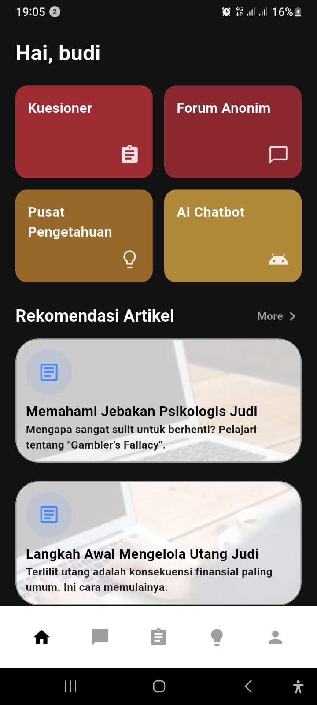
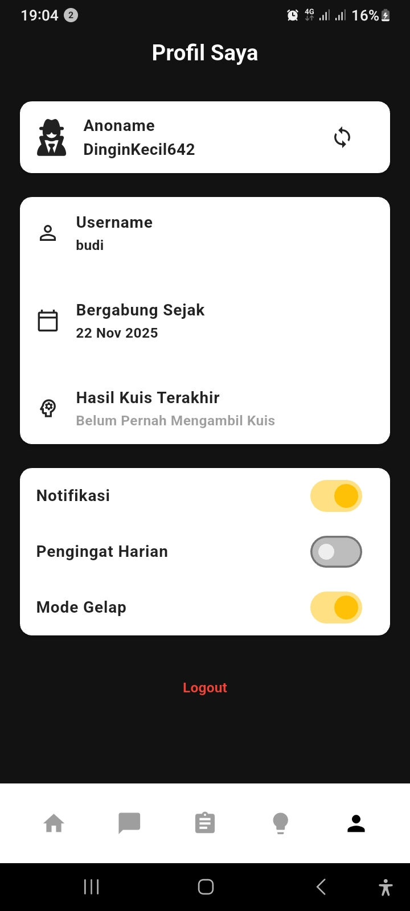
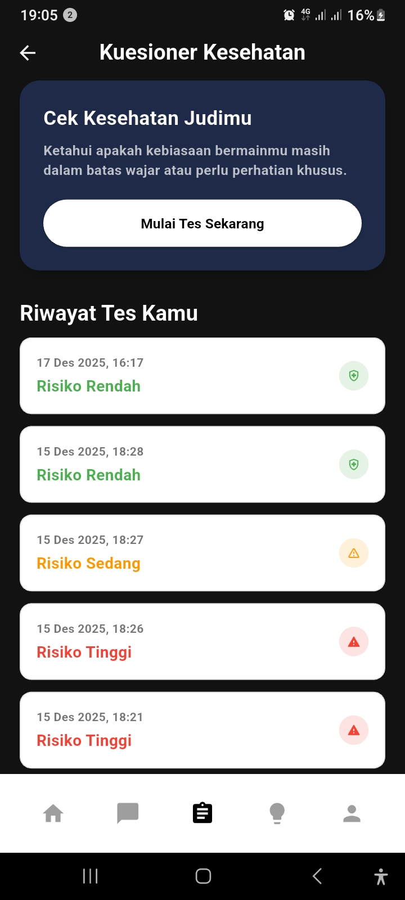
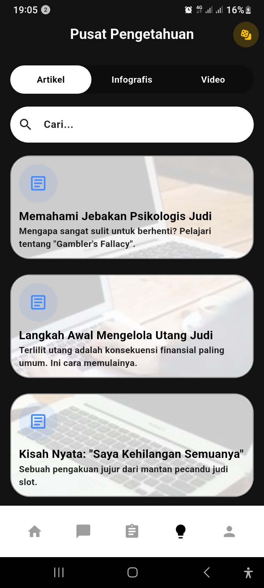
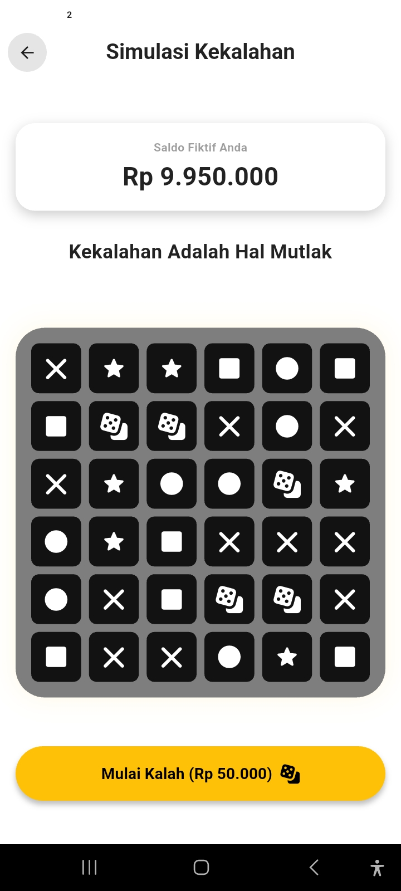
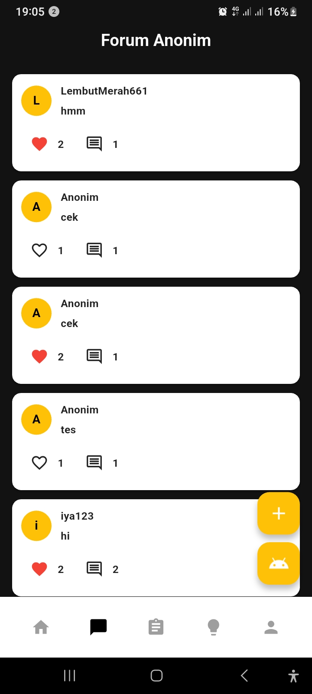
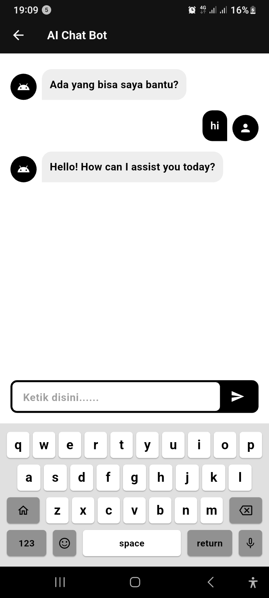

# 🛡️ JagaJiwa

**Ruang Aman Anda untuk Dukungan dan Edukasi Seputar Judi Online**

[](https://github.com/Garmandsk/jagajiwa)
[](https://opensource.org/licenses/MIT)

"JagaJiwa" adalah aplikasi mobile pendamping digital yang dirancang untuk pencegahan dan intervensi dini terhadap kecanduan judi online di Indonesia. Aplikasi ini menyediakan platform yang aman, anonim, dan suportif bagi siapa saja yang ingin memahami, mencegah, atau memulai langkah awal keluar dari masalah perjudian.

link release:
https://github.com/Garmandsk/jagajiwa/releases/tag/v1.0.1

link srs:
https://docs.google.com/document/d/1dxfvALFm5kiYgB0Bmj5SsydT8GSo0GEbEomE0gLtYzw/edit?usp=sharing

## ✨ Fitur Utama

Aplikasi kami dibangun dengan 8 fitur inti yang berfokus pada dukungan dan edukasi:

* **🔒 Autentikasi Anonim:** Daftar hanya dengan info minimal, dapatkan `anoname` (nama anonim) otomatis untuk berinteraksi.
* **🧠 Kuesioner Psikologis:** Ambil kuesioner berbasis Problem Gambling Severity Index (PGSI) untuk mengevaluasi tingkat risiko perjudian Anda.
* **📚 Pusat Pengetahuan:** Pustaka lengkap berisi artikel, infografis, dan video untuk memberi Anda pengetahuan faktual.
* **💸 Simulasi Kekalahan:** Rasakan pengalaman "anti-judi" yang dirancang untuk mematahkan ilusi kemenangan judi.
* **💬 Forum Anonim:** Ruang aman untuk berbagi cerita, bertanya, dan saling mendukung dengan pengguna lain menggunakan `anoname` Anda.
* **🤖 Chatbot AI:** Dapatkan dukungan atau jawaban cepat 24/7 melalui pendamping virtual berbasis AI.
* **👤 Pengaturan Profil:** Kelola akun Anda, ganti `anoname` kapan saja, dan lihat riwayat kuesioner Anda.
* **🏠 Beranda:** Dasbor utama Anda untuk mengakses semua fitur dengan mudah.

## 📸 Tampilan Aplikasi

| Splash Screen | Welcome Screen | Daftar |
| :---: | :---: | :---: |
|  |  |  |
| **Tampilan Splash Screem** | **Tampilan Welcome Screen** | **Tampilan Daftar** |

| Masuk | Beranda | Pengaturan Profil |
| :---: | :---: | :---: |
|  |  |  |
| **Tampilan Masuk** | **tampilan Beranda** | **Tampilan Pengaturan Profil** |

| Kuesioner Psikologis | Pusat Pengetahuan | Simulasi Kekalahan |
| :---: | :---: | :---: |
|  |  |  |
| **Tampilan Kuesioner Psikologis** | **tampilan Pusat Pengetahuan** | **Tampilan Simulasi Kekalahan** |

| Forum Anonim | Chatbot AI |
| :---: | :---: |
|  |  | 
| **Tampilan Forum Anonim** | **tampilan Chatbot AI** |

## 🛠️ Teknologi yang Digunakan

* **Frontend:** [Flutter](https://flutter.dev/) (Dart) 
* **Backend:** [Supabase](https://supabase.com/) (BaaS - PostgreSQL, Auth, Storage)
* **State Management:** [Provider](https://pub.dev/packages/provider)
* **Navigasi:** [GoRouter](https://pub.dev/packages/go_router)
* **Desain:** [Figma](https://www.figma.com/design/GsvTPi2HqXs5h9B7b8PMBZ/JagaJiwa?node-id=6002-4839&t=mvaFY7e6WK0bcl2h-1)

## 📁 Struktur Repositori

Proyek ini menggunakan struktur **Monorepo**. Semua kode berada dalam satu repositori tetapi dipisahkan menjadi dua folder utama:

````
/
├── 📁 frontend/   (Aplikasi Flutter - Baca /frontend/README.md untuk detail setup)
├── 📁 backend/    (Dokumentasi Backend - Baca /backend/README.md untuk kebijakan)
└── 📜 README.md   (Anda sedang membaca ini)

````

## 📖 Panduan untuk Pengguna Umum

Aplikasi ini adalah alat bantu gratis yang bertujuan memberikan edukasi dan dukungan komunitas. Jika Anda atau seseorang yang Anda kenal sedang berjuang melawan kecanduan judi, aplikasi ini dapat menjadi langkah awal yang baik untuk mendapatkan kesadaran diri dan menemukan komunitas yang suportif.

## 👥 Panduan untuk Kontributor

Kami menyambut semua kontributor!  
Untuk berkontribusi pada proyek ini, silakan ikuti langkah-langkah di bawah ini.

### Alur Kerja Git (Git Workflow)

Kami menggunakan alur kerja **Agile** dengan *feature branching*. **DILARANG PUSH LANGSUNG KE `main` ATAU `develop`**.

1.  **Clone Repositori:** (Jika Anda belum melakukannya dari *root*)
    ```bash
    git clone https://github.com/Garmandsk/jagajiwa.git
    ```
2.  **Masuk ke Folder Frontend:**
    ```bash
    cd jagajiwa/frontend
    ```
3.  **Install Dependensi:**
    ```bash
    flutter pub get
    ```
4.  **Konfigurasi Environment (SANGAT PENTING):**
    Aplikasi ini perlu terhubung ke Supabase.
    * Buat file baru di `frontend/lib/` bernama `.env`.
    * Isi file tersebut dengan kredensial Supabase Anda (tanyakan pada Project Manager atau lihat di dashboard Supabase):
        ```ini
        SUPABASE_URL=https://<project-id>.supabase.co
        SUPABASE_ANON_KEY=<your-public-anon-key>
        ```
    * *Catatan: Pastikan file `.env` ini sudah ditambahkan ke `.gitignore`!*
    * (Pastikan Anda telah memuat variabel-variabel ini di `main.dart` Anda, biasanya menggunakan *package* `flutter_dotenv`).
5.  **Mulai dari `develop`:**
    ```bash
    git checkout develop
    git pull origin develop
    ```
6.  **Buat Branch Fitur Baru:**
    ```bash
    git checkout -b feature/nama-fitur-anda
    ```
7.  **Kerjakan & Commit:**
    * Lakukan perubahan kode Anda.
    * *Commit* dengan pesan yang jelas/semantic (misal: `feat: Menambahkan tombol logout di profil`).
8.  **Buat Pull Request (PR):**
    * Push *branch* Anda ke GitHub (`git push origin feature/nama-fitur-anda`).
    * Buka GitHub dan buat **Pull Request** dari *branch* Anda ke *branch* `develop`.
9.  **Review & Merge:**
    * Tunggu minimal 1 anggota tim lain me-review PR Anda.
    * Setelah disetujui, PR akan di-*merge* ke `develop`.

### Setup Proyek

* **Untuk Backend:** Baca panduan di **`backend/README.md`** untuk memahami kebijakan manajemen database.
* **Untuk Frontend:** Baca panduan di **`frontend/README.md`** untuk instruksi lengkap cara menjalankan aplikasi Flutter.

## 👨‍💻 Tim Pengembang


* **Azlinsyah Fadhilah Meran** (231401013) 
* **Qadrul Dzul Dina** (231401088)
* **Muhammad Thomi Dzakwan Nasution** (231401124) 
* **Gerti Armanda Sembiring** (231401133)https://github.com/Garmandsk/jagajiwa/releases/tag/v1.0.1