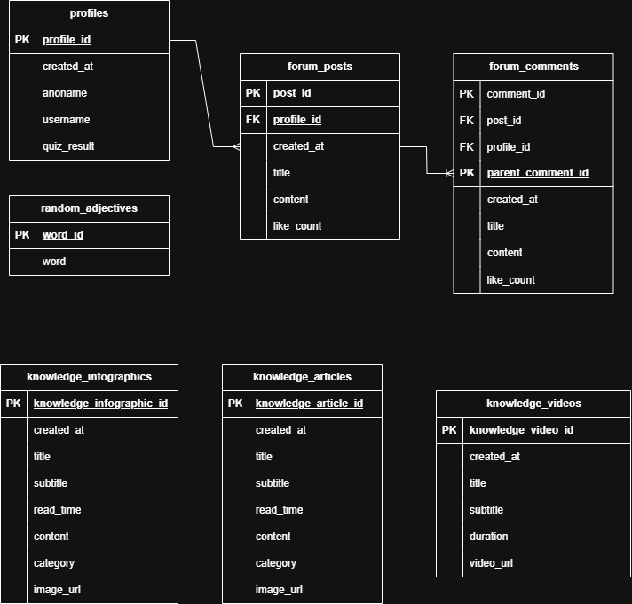

# 🗄️ Backend JagaJiwa 

Folder ini berisi dokumentasi dan skrip yang terkait dengan infrastruktur *backend* JagaJiwa.

## ⚠️ Peringatan Penting

Folder ini **BUKAN** aplikasi *backend* yang bisa dijalankan. Proyek ini menggunakan **Supabase** (Backend-as-a-Service).

**Semua manajemen backend (pembuatan tabel, fungsi, RLS, dll.) dilakukan secara manual melalui Dashboard Supabase.**

## 📜 Kebijakan Dokumentasi

Folder ini ada untuk tujuan **dokumentasi** dan *version control* terhadap skema database kita.

**KEBIJAKAN WAJIB:**
Setiap kali seorang anggota tim melakukan **perubahan skema** (ALTER TABLE, CREATE TABLE, CREATE FUNCTION, dll.) di Dashboard Supabase, dia **WAJIB** menyalin skrip SQL yang relevan dan menyimpannya di folder `docs/` (atau `migrations/`) di dalam direktori `backend/` ini.

**Contoh:**
`backend/docs/2025-10-30_add_like_count_to_forum_posts.sql`

Ini adalah pengganti kita untuk manajemen migrasi otomatis dan memastikan semua anggota tim memiliki catatan perubahan struktur database.

## 🏛️ Arsitektur Data (ERD)

Fondasi data aplikasi kita didasarkan pada model relasional di PostgreSQL. [cite_start]Untuk detail lengkap mengenai skema, tabel, dan relasi, silakan merujuk ke **Gambar 4: Entity Relationship Diagram** di dokumen SRS.

-----